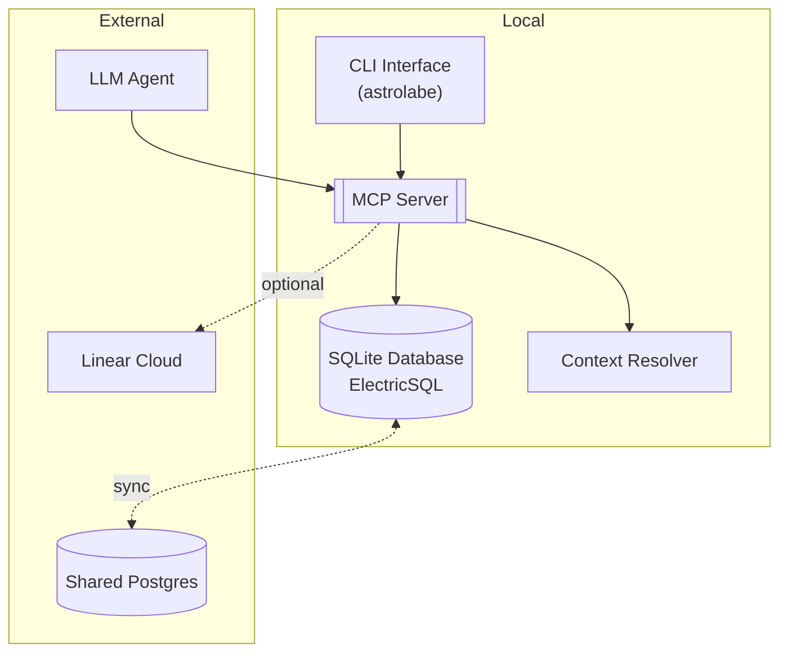

# AGENTS Onboarding Guide

Welcome to **Astrolabe** – a local-first, MCP-compatible task-navigation platform for humans + AI agents. This document explains how to get a new contributor from zero to productive while maintaining the code quality bar we expect in production.

> **Why "Astrolabe"?** An astrolabe helped medieval sailors locate themselves from the stars. Likewise, this tool helps developers & agents "plot their position" in a project—offline, precisely, and with just one reading.

---

## 0 · Prerequisites

| Tool        | Version    | Notes                                                                                           |
| ----------- | ---------- | ----------------------------------------------------------------------------------------------- |
| **Node.js** | ≥ 18 LTS   | ES2020 targets & built-in `fetch`                                                               |
| **pnpm**    | ≥ 8        | Fast, content-addressable install                                                               |
| **Git**     | ≥ 2.40     | Needed for version control                                                                      |
| **SQLite**  | ≥ 3.40     | Local database backend                                                                          |
| **Nix**     | _optional_ | For reproducible development environment                                                        |
| **Biome**   | ≥ 1.9      | Installed via `@biomejs/biome` for CI/non-Nix systems; NixOS users get system binary from flake |

---

## 1 · Repository Layout

```text
packages/            # Monorepo packages (pnpm workspace)
  core/              # Core application library (@astrolabe/core)
    src/             # TypeScript source code
      index.ts       # Main exports
  cli/               # Command-line interface
    source/          # CLI source code
  mcp/               # Model Context Protocol server
    src/             # MCP server source
tasks/               # Task Master integration files
scripts/             # Development and build scripts
docs/                # Project documentation
  design.md          # Architecture and design decisions
.cursor/             # Cursor AI configuration and rules
  rules/             # AI agent guidance rules
.taskmasterconfig    # Task Master AI configuration
pnpm-workspace.yaml  # Workspace configuration
biome.json           # Code formatting and linting rules
tsconfig.json        # TypeScript configuration
flake.nix            # Nix development environment
```

---

## 2 · Bootstrap

```bash
# Install dependencies
pnpm install

# Build the project
pnpm build

# Start development mode with hot reload
pnpm dev

# Run type checking
pnpm type-check
```

> **Tip:** If using Nix, run `direnv allow` to automatically enter the development environment.

---

## 3 · Quality-Assured Development Workflow

### 3.1 Code Quality Standards

We use **Biome** for both linting and formatting to maintain consistent code quality:

| Task           | Command           | Purpose                 |
| -------------- | ----------------- | ----------------------- |
| **Lint**       | `pnpm lint`       | Check code for issues   |
| **Lint Fix**   | `pnpm lint:fix`   | Auto-fix linting issues |
| **Format**     | `pnpm format`     | Check code formatting   |
| **Format Fix** | `pnpm format:fix` | Auto-format code        |
| **Type Check** | `pnpm type-check` | Verify TypeScript types |

### 3.2 Pre-commit Workflow

Before committing code, ensure all quality checks pass:

```bash
pnpm verify
```

> **🚦 CI Gate:** _Every_ commit **must pass** `pnpm verify` (build, lint, format, type-check, tests) locally before pushing. The CI pipeline will reject any commit that fails these commands.

### 3.3 Biome Configuration Highlights

Our `biome.json` enforces:

- Single quotes, semicolons, ES5 trailing commas
- 100-character line width with 2-space indentation
- Import organization and unused import removal
- No excessive cognitive complexity
- Console.log warnings (use proper logging in production)

---

## 4 · Project Architecture

Astrolabe is built with offline-first principles and MCP compatibility:



### Key Components

- **Local-First Database**: SQLite with ElectricSQL for offline-first sync (view docs/ELECTRIC.md for details)
- **MCP Server**: JSON-RPC API for LLM agent integration
- **Type Safety**: Zod schemas for runtime validation
- **Context Resolution**: Smart task context bundling for agents

---

## 5 · TypeScript Conventions

- **Strict TypeScript** – `"strict": true` with enhanced strictness:
  - `noUnusedLocals`, `noUnusedParameters`
  - `exactOptionalPropertyTypes`, `noImplicitReturns`
  - `noUncheckedIndexedAccess`, `noImplicitOverride`
- **Runtime Validation** – Use Zod schemas for all data models

- use pnpm as package manager

- **Simple first** - Optimize for simple, clean, readable code
- **Immutable Data** – Prefer `readonly` and `const` assertions
- **ES Modules** – Native ESM with Node16 module resolution
- **No `any`** – Explicit typing required, reject in PR review

Sample data model pattern:

```typescript
import { z } from "zod";

export const TaskSchema = z.object({
  id: z.string().uuid(),
  title: z.string().min(3),
  status: z.enum(["todo", "doing", "blocked", "done"]),
  createdAt: z.date(),
  updatedAt: z.date(),
});

export type Task = z.infer<typeof TaskSchema>;
```

---

## 6 · Cursor AI Integration

The project includes comprehensive Cursor rules in `.cursor/rules/`:

- **`dev_workflow.mdc`** – Task Master development workflow
- **`taskmaster.mdc`** – Complete MCP tool reference
- **`self_improve.mdc`** – Guidelines for improving rules
- **`cursor_rules.mdc`** – Rule formatting standards

These rules enable AI agents to:

- Navigate tasks efficiently using Task Master
- Understand MCP integration patterns
- Follow consistent coding conventions
- Maintain high code quality

---

## 7 · MCP Function Reference

Core functions that LLM agents can call (based on design.md):

| Function         | Purpose                                 |
| ---------------- | --------------------------------------- |
| `listTasks`      | Get filtered task lists with pagination |
| `createTask`     | Create new tasks with validation        |
| `updateTask`     | Update existing tasks                   |
| `deleteTask`     | Soft delete tasks                       |
| `getTaskContext` | Get full context bundle for a task      |
| `completeTask`   | Mark tasks complete and generate digest |
| `importPrd`      | Convert PRD documents to tasks          |
| `exportPrd`      | Tasks to Markdown PRD format            |
| `renderGraph`    | Generate dependency graphs              |
| `syncLinear`     | Two-way Linear integration (optional)   |

---

## 8 · Development Commands

| Purpose            | Command            |
| ------------------ | ------------------ |
| Development server | `pnpm dev`         |
| Build production   | `pnpm build`       |
| Type checking      | `pnpm type-check`  |
| Lint & fix         | `pnpm lint:fix`    |
| Format & fix       | `pnpm format:fix`  |
| Full quality check | See workflow above |

---

## 9 · Task Master Integration

This project uses Task Master AI for task management. Key workflows:

```bash
# Initialize Task Master (if not done)
task-master init

# List current tasks
task-master list

# Get next task to work on
task-master next

# Add new tasks
task-master add-task --prompt="Implement feature X"

# Update task status
task-master set-status --id=1 --status=done
```

See the [dev_workflow.mdc](.cursor/rules/dev_workflow.mdc) rule for complete guidance.

---

## 10 · Project Goals

| Goal   | Description                             |
| ------ | --------------------------------------- |
| **G1** | 100% project workflow offline           |
| **G2** | One MCP call returns full task context  |
| **G3** | Friendly CLI & VS Code—no DB spelunking |
| **G4** | End-to-end type safety                  |
| **G5** | Optional Linear/GitHub mirroring        |

---

## 11 · CLI Vision (Future)

Future CLI layout based on design:

```
astrolabe ─┬ task     list|add|update|rm|done
           ├ context  show <taskId>
           ├ prd      import <file> | export <epicIds>
           ├ graph    render [--format mermaid]
           ├ sync     linear push|pull [--label linear]
           └ db       migrate|status
```

### Command Examples

```bash
# list open tasks
astrolabe task list --status todo

# quick capture
astrolabe task add "Add OAuth flow" --parent epic:auth

# one-shot context bundle for an agent
astrolabe context show 123e456-…

# push tasks tagged #linear
astrolabe sync linear push
```

---

## 12 · Getting Help

- **Design Document**: [docs/design.md](docs/design.md)
- **Cursor Rules**: [.cursor/rules/](.cursor/rules/)
- **Task Master**: [.cursor/rules/taskmaster.mdc](.cursor/rules/taskmaster.mdc)
- **Biome Configuration**: [biome.json](biome.json)
- **TypeScript Config**: [tsconfig.json](tsconfig.json)

---

**Happy hacking!** Follow the quality gates, respect the Cursor rules, and leverage Task Master for efficient development. Your code will merge first time, every time. 🌌
