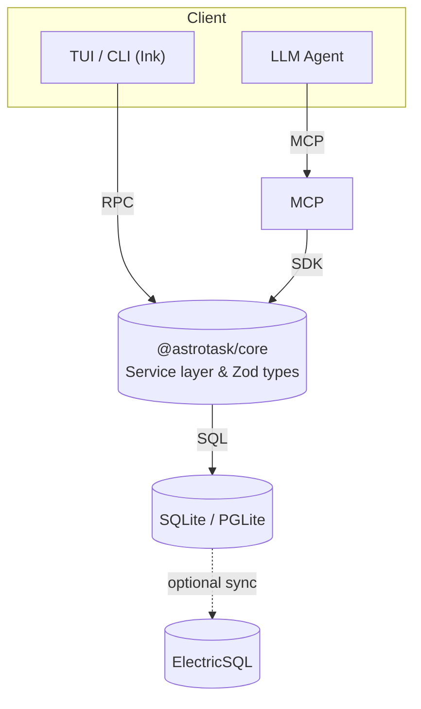

# Astrotask

> **Local-first task management built for humans _and_ AI agents**
>
> offline-ready · MCP-compatible · type-safe · extensible


---

Astrotask is a modern, local-first task platform that lets you and your favourite AI assistant share the **same single-player database**. It combines an ergonomic CLI, a rich TUI dashboard, a **Model Context Protocol (MCP)** server, and a type-safe JavaScript/TypeScript SDK—all backed by SQLite.

---

## Table of contents

- [Features](#features)
- [Installation](#installation)
- [Quick-start](#quick-start)
  - [CLI](#cli)
  - [Programmatic](#programmatic)
  - [AI / MCP](#ai--mcp)
- [Adding tasks](#adding-tasks)
  - [Manual (CLI)](#manual-cli)
  - [Generate from a PRD](#generate-from-a-prd)
  - [Ask an agent (MCP)](#ask-an-agent-mcp)
- [Operating & running tasks](#operating--running-tasks)
- [Screenshots](#screenshots)
- [How it works](#how-it-works)
- [Contributing](#contributing)
- [Roadmap](#roadmap)
- [License](#license)

---

## Features

### 🏠 Local-first

- Works 100 % offline using SQLite (or PGLite/WASM in the browser)
- Optional ElectricSQL replication coming soon

### 🤖 AI-native

- Ships with a **MCP** server so LLM agents can call `listTasks`, `addTasks`, `updateStatus`, etc.
- Built-in context bundling → agents always receive the right slice of the tree

### 🌲 Hierarchical tasks & dependencies

- Unlimited depth, rich metadata, first-class dependency graph
- Smart filters hide closed work by default

### 🚀 Developer experience

- Fully-typed TypeScript SDK (`@astrotask/core`)
- Zero-config CLI / TUI built with React-Ink (`astrotask`)
- Batteries-included templates & tests

---

## Installation

Astrotask is distributed as a collection of packages. For most users the CLI is the entry-point:

```bash
# …until we hit v1.0 we recommend installing the latest pre-release
npm install -g @astrotask/cli@next            # or pnpm / yarn
```

Upgrading is just as easy:

```bash
npm update -g @astrotask/cli
```

> **Prerequisites** – Node 18+, SQLite 3.40+, and `pnpm` if you wish to hack on the monorepo.

---

## Quick-start

### CLI

```bash
# 1. Create a new workspace
mkdir my-project && cd my-project

# 2. Initialise Astrotask (creates ./data/astrotask.db and starter rules)
astrotask init

# 3. Add a task and view it
astrotask task add "Ship public launch"
astrotask task list

# 4. Open the live dashboard (press <c> to toggle completed)
astrotask dashboard
```

### Programmatic

```ts
import { createDatabase } from "@astrotask/core";

const db = await createDatabase({
  dataDir: "./data/astrotask.db",
});

await db.addTask({
  title: "Implement OAuth",
  description: "Add Google login",
});
```

### AI / MCP

```bash
# Run the MCP server on port 4242 using the same local DB
DATABASE_URI=sqlite://./data/astrotask.db \
node $(npm root -g)/@astrotask/mcp/dist/index.js --port 4242
```

Configure your agent (Cursor, ChatGPT plug-in, …) with the endpoint and start calling tools such as:

```json
{
  "name": "getNextTask",
  "arguments": { "priority": "high" }
}
```

---

## Adding tasks

### Manual (CLI)

```bash
# simple capture
astrotask task add "Write onboarding docs"

# add under a parent and set priority
astrotask task add "Design hero section" --parent 123e456… --priority high
```

### Generate from a PRD

Astrotask ships with an AI generator that can break a spec into structured work:

```bash
astrotask task generate --file ./specs/authentication.prd.md --parent epic:auth
```

`--dry` will preview the output without touching your DB.

### Ask an agent (MCP)

Any MCP-aware agent can create tasks in your local graph:

```json
{
  "name": "addTasks",
  "arguments": {
    "tasks": [
      {
        "title": "Refactor caching layer",
        "description": "Move from LRU to ARC",
        "priority": "medium"
      }
    ]
  }
}
```

---

## Operating & running tasks

| Action                            | Command                                    |
| --------------------------------- | ------------------------------------------ |
| See what to do next               | `astrotask task next`                      |
| Full list (pending & in-progress) | `astrotask task list`                      |
| Mark done                         | `astrotask task done <id>`                 |
| Update fields                     | `astrotask task update <id> --status done` |
| Visualise tree                    | `astrotask task tree [--root <id>]`        |
| Validate dependencies             | `astrotask dependency validate`            |
| Interactive dashboard             | `astrotask dashboard`                      |

The CLI is built with Ink—you always get **live** updates and colours. All commands accept `--help`.

---

## Screenshots


---

## How it works



1. **@astrotask/core** provides a type-safe service layer over the local database.
2. The **CLI/TUI** talks to the SDK directly.
3. The **MCP server** exposes the same operations to AI tools via JSON-RPC.
4. Thanks to SQLite WAL mode we get safe concurrent access (dashboard + agent + script).

Design principles:

- _Local-first_ – Data should be useful without a network.
- _One source of truth_ – CLI, SDK, and MCP all share the same database file.
- _Explicit context_ – Agents receive structured bundles, never raw SQL.
- _Type-safe all the way_ – Zod runtime validation mirrors the TypeScript types.

---

## Contributing

We ♥ new contributors! Please read [AGENTS.md](AGENTS.md) for the philosophy and the [contributing guide](docs/guides/contributing.md) for coding standards.

- Code must pass `pnpm verify` (build ➜ type-check ➜ lint ➜ test).
- Keep rules / docs in sync with code changes.
- Small PRs > big bang.

---

## Roadmap

| Milestone | Focus                             |
| --------- | --------------------------------- |
| v0.2      | Polished CLI & MCP, dependency UX |
| v0.3      | ElectricSQL sync + web dashboard  |
| v1.0      | Mobile apps, plug-in ecosystem    |

---

## License

Astrotask is released under the **MIT License**.
