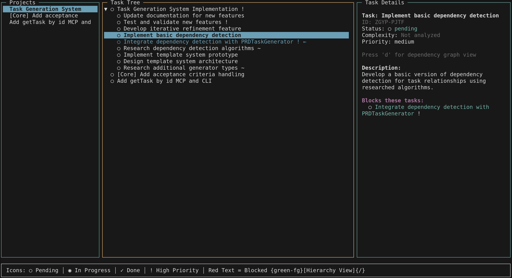

# Astrotask

> **Coordinate work with your AI agents – no more "sorry, I can't help with this codebase!"**

[](https://discord.gg/YOUR_INVITE)

[](https://codecov.io/gh/marktoda/astrotask)


## Overview

Astrotask is a modern, local-first task platform that lets you and your favourite AI assistant share the **same single-player database**. It combines an ergonomic CLI, a rich TUI dashboard, a **Model Context Protocol (MCP) server**, and a full TypeScript SDK.

**Why does this matter?**
- ✅ Your AI can see exactly what you're working on, plan next steps, and update task status
- ✅ No cloud lock-in – everything lives in your local SQLite database
- ✅ Git-friendly – commit your task database alongside your code
- ✅ Works offline first, with optional team synchronization later

**What's included:**
- Task management with hierarchies, dependencies, and rich context
- Complexity analysis and automatic task breakdown
- Interactive terminal dashboard
- MCP server for Claude Desktop, Cursor, and other MCP clients
- Full TypeScript SDK for custom integrations

---

## Features

**Core Task Management:**
- ✅ **Hierarchical tasks** – organize work into parent/child relationships
- ✅ **Task dependencies** – model blocked/blocking relationships  
- ✅ **Rich context** – attach notes, links, and implementation details
- ✅ **Status tracking** – pending, in-progress, done, cancelled, archived
- ✅ **Priority levels** – high/medium/low with intelligent filtering

**AI Integration:**
- ✅ **MCP server** – works with Claude Desktop, Cursor, and other MCP clients
- ✅ **Complexity analysis** – automatically identify tasks that need breakdown
- ✅ **Task generation** – convert specs/PRDs into structured work
- ✅ **Context sharing** – AI sees your full task context and history

**Developer Experience:**
- ✅ **Local-first** – all data stored in local SQLite database
- ✅ **Git-friendly** – commit your task database with your code
- ✅ **TypeScript SDK** – build custom integrations and workflows
- ✅ **Terminal UI** – beautiful, interactive dashboard in your terminal
- ✅ **Performance** – optimized for thousands of tasks with sub-100ms queries

**Enterprise Ready:**
- ✅ Fully-typed TypeScript SDK (`@astrotask/core`)
- ✅ Zero-config CLI / TUI built with React-Ink (`astro`)
- ✅ Comprehensive test coverage and error handling
- ✅ Local-first with optional team sync (coming soon)

---

## Installation

Astrotask is distributed as a collection of packages. For most users the CLI is the entry-point:

```bash
# Install the CLI globally
npm install -g @astrotask/cli@next            # or pnpm / yarn
```

To update to the latest version:

```bash
# Update to latest
npm update -g @astrotask/cli
```

---

## Quick Start

Let's get you up and running in under 2 minutes:

```bash
# 1. Install globally
npm install -g @astrotask/cli

# 2. Initialise Astrotask (creates ./data/astrotask.db and starter rules)
astro init

# 3. Add your first task
astro task add "Ship public launch"
astro task list

# 4. Launch the interactive dashboard
astro dashboard
```

**SDK Usage:**

```typescript
import { createDatabase } from "@astrotask/core";

const db = await createDatabase({
  dataDir: "./data/astrotask.db",
});

// Add tasks, manage dependencies, analyse complexity
const task = await db.tasks.add({ title: "Build authentication" });
```

**MCP Server (for AI assistants):**

```bash
# Run MCP server on port 4242 (for Claude Desktop integration)
DATABASE_URI=sqlite://./data/astrotask.db \
node $(npm root -g)/@astrotask/mcp/dist/index.js --port 4242
```

---

## Usage Examples

**Basic Task Management:**

```bash
# Add tasks with hierarchy and metadata
astro task add "Write onboarding docs"

# Create child tasks with priorities  
astro task add "Design hero section" --parent 123e456… --priority high
```

**AI-Powered Task Generation:**

Astrotask ships with an AI generator that can break a spec into structured work:

```bash
astro task generate --file ./specs/authentication.prd.md --parent epic:auth
```

This will:
1. Analyze the spec for complexity and dependencies
2. Break it down into manageable tasks
3. Set up parent/child relationships automatically
4. Add contextual notes and acceptance criteria

**Common Workflows:**

| Action                            | Command                                   |
|-----------------------------------|-------------------------------------------|
| See what to do next               | `astro task next`                      |
| Full list (pending & in-progress) | `astro task list`                      |
| Mark done                         | `astro task done <id>`                 |
| Update fields                     | `astro task update <id> --status done` |
| Visualise tree                    | `astro task tree [--root <id>]`        |
| Validate dependencies             | `astro dependency validate`            |
| Interactive dashboard             | `astro dashboard`                      |

---

## Dashboard

The built-in terminal dashboard gives you a real-time view of all your work:



**Features:**
- 📊 **Real-time task overview** – see pending, in-progress, and completed work
- 🔍 **Advanced filtering** – by status, priority, parent task, or search term
- ⌨️ **Keyboard shortcuts** – navigate and update tasks without leaving the terminal
- 📈 **Progress tracking** – visual progress bars and completion percentages
- 🔗 **Dependency visualization** – see what's blocked and what's ready to work on

---

## Architecture

```mermaid
graph TB
    CLI[CLI / Dashboard<br>(@astrotask/cli)]
    MCP[MCP Server<br>(@astrotask/mcp)]
    Core[("@astrotask/core\nService layer & Zod types")]
    DB[(Local SQLite<br>./data/astrotask.db)]
    
    CLI --> Core
    MCP --> Core
    Core --> DB
```

1. **@astrotask/core** provides a type-safe service layer over the local database.
2. **@astrotask/cli** offers task management, a dashboard, and maintenance commands.
3. **@astrotask/mcp** exposes an MCP server so AI assistants can read/write tasks.

All components share the same local SQLite database – no network calls, no vendor lock-in.

---

## MCP Integration

The MCP server enables AI assistants to:
- View your current tasks and context
- Add new tasks and break down complex work
- Update task status as work progresses
- Understand project structure and dependencies

**Available MCP Functions:**
- `getNextTask()` – Get the most important task to work on
- `addTasks()` – Create tasks with hierarchy and dependencies  
- `listTasks()` – Filter and search existing tasks
- `updateStatus()` – Mark tasks as in-progress, done, etc.
- `addTaskContext()` – Attach notes and implementation details
- `addDependency()` – Model task relationships

**Setup with Claude Desktop:**
Add this to your Claude Desktop MCP configuration to get started.

---

## Development

```bash
# Clone and install
git clone https://github.com/your-org/astrotask
cd astrotask && pnpm install

# Build all packages
pnpm build

# Run tests
pnpm test

# Start development
pnpm dev
```

---

## License

Astrotask is released under the **MIT License**.
