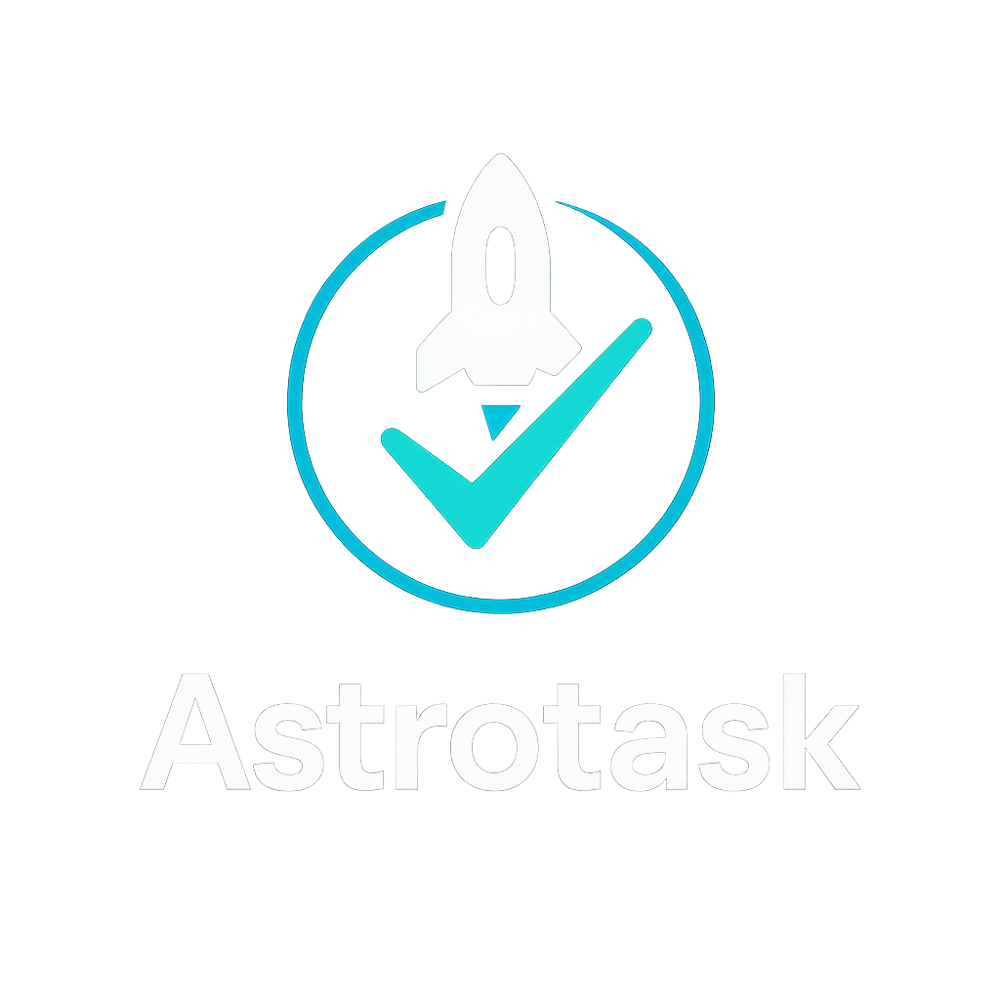

# Astrotask



**Task manager built for humans _and_ AI agents**

Offline‑ready · MCP‑compatible · Fully‑type‑safe · Extensible

[](https://www.npmjs.com/package/@astrotask/cli)
[](LICENSE)
[](https://github.com/marktoda/astrotask/actions)

---

## Why Astrotask?

Astrotask keeps workstreams organised and agent‑ready:

- **Stay on track** – persistent workspace records every decision and status change.
- **Parallel agent orchestration** – multiple agents can tackle non‑blocking tasks simultaneously; the dependency graph prevents collisions.
- **Rich, evolving context** – attach arbitrary metadata, comments, and notes to improve recall and quality of work.
- **Situational awareness** – agents can refetch the original task prompt at any time and understand where it fits in the wider roadmap.
- **Offline‑first** – capture ideas without a network and sync when back online.

---

## Table of Contents

- [Installation](#installation)
- [Quick Start](#quick-start)
  - [CLI](#cli)
  - [Programmatic](#programmatic)
  - [AI / MCP](#ai--mcp)
- [Adding Tasks](#adding-tasks)
- [Operating & Running Tasks](#operating--running-tasks)
- [Screenshots](#screenshots)
- [How It Works](#how-it-works)
- [Contributing](#contributing)
- [Roadmap](#roadmap)
- [License](#license)

---

## Installation

```bash
# Until v1.0 install the latest pre‑release tag
npm install -g @astrotask/cli@next      # or: pnpm / yarn
```

Upgrading is just as easy:

```bash
npm update -g @astrotask/cli
```

> **Prerequisites**  Node 18+, SQLite 3.40+, and `pnpm` if you plan to work on the monorepo.

After installation you'll have the `astro` command in your PATH.

---

## Quick Start

### CLI

```bash
# 1. Create a workspace
mkdir my-project && cd $_

# 2. Initialise Astrotask (creates ./data/astrotask.db and starter rules)
astro init

# 3. Add tasks and view them
❯ astro task add "Create README"
❯ astro task generate --file docs/task-generation-implementation.md
❯ astro task tree
🌳 Task Tree (All Tasks) (pending and in-progress only)
💡 Use --show-all to include completed and archived tasks
├── ⏳ Create README (AFDR) [pending]
├── ⏳ Task ID System and TaskTree Architecture (BXCQ) [pending]
│   ├── ⏳ Create task creation logic (BXCQ-RKGO) [pending]
│   ├── ⏳ Implement task tree structure (BXCQ-BTTS) [pending]
│   ├── ⏳ Implement task ID validation functions (BXCQ-PDPT) [pending]
│   ├── ⏳ Implement subtask ID generation function (BXCQ-ZGWZ) [pending]
│   ├── ⏳ Implement task ID generation function (BXCQ-QDPA) [pending]
│   └── ⏳ Design database schema for tasks (BXCQ-FUZS) [pending]

# 4. Open the live dashboard (press <c> to toggle completed tasks)
astro dashboard
```

### Programmatic

```ts
import { createAstrotask } from "@astrotask/core";

const astrotask = await createAstrotask({
  databaseUrl: "./data/astrotask.db",
});

await astrotask.tasks.addTask({
  title: "Implement OAuth",
  description: "Add Google login",
});
```

### AI / MCP

```json
{
  "mcpServers": {
    "astrotask-task": {
      "command": "npx",
      "args": ["@astrotask/mcp"],
      "env": {
        "DATABASE_PATH": "/home/toda/dev/astrotask/data/astrotask.db"
      }
    }
  }
}
```

OR

```bash
astro init
```

Configure your agent (Cursor, ChatGPT plug‑in, …) with the endpoint and start calling tools such as:

```bash
$ Start working on the next task and track your progress in astrotask

{
  "name": "getNextTask",
  "arguments": { "priority": "high" }
}
```

---

## Adding Tasks

### Manual (CLI)

```bash
# Simple capture
astro task add "Write onboarding docs"

# Add under a parent and set priority
astro task add "Design hero section" --parent <parentId> --priority high
```

### Generate from a PRD

Break a spec into structured work:

```bash
astro task generate --file ./specs/authentication.prd.md
# Use --dry to preview without touching your DB
```

### Ask an Agent (MCP)

```json
{
  "name": "addTasks",
  "arguments": {
    "tasks": [
      {
        "title": "Refactor caching layer",
        "description": "Move from LRU to ARC",
        "priority": "medium"
      }
    ]
  }
}
```

---

## Operating & Running Tasks

| Action                            | Command                                |
| --------------------------------- | -------------------------------------- |
| See what to do next               | `astro task next`                      |
| Full list (pending & in‑progress) | `astro task list`                      |
| Mark done                         | `astro task done <id>`                 |
| Update fields                     | `astro task update <id> --status done` |
| Visualise tree                    | `astro task tree [--root <id>]`        |
| Validate dependencies             | `astro dependency validate`            |
| Interactive dashboard             | `astro dashboard`                      |

All commands accept `--help`.

---

## Screenshots


---

## How It Works

1. `@astrotask/core` provides a type‑safe service layer over the local database.
2. The CLI/TUI (`astro`) talks to the SDK directly.
3. The MCP server exposes the same operations to AI tools via JSON‑RPC.
4. SQLite WAL mode gives safe concurrent access (dashboard + agent + script).

**Design principles**

- **Local‑first** – Data should be useful without a network.
- **Single source of truth** – CLI, SDK & MCP all share the same database file.
- **Explicit context** – Agents receive structured bundles, never raw SQL.
- **Type‑safe all the way** – Zod runtime validation mirrors TypeScript types.

---

## Contributing

We ♥ new contributors! See [CONTRIBUTING.md](CONTRIBUTING.md) and [AGENTS.md](AGENTS.md) for philosophy & guidelines.

- Code must pass `pnpm verify` (`build ➜ type-check ➜ lint ➜ test`).
- Keep rules/docs in sync with code changes.
- Small PRs > big bang.

---

## Roadmap

| Milestone | Focus                       |
| --------- | --------------------------- |
| **v0.2**  | ElectricSQL synchronization |
| **v0.3**  | Web dashboard               |

---

## License

Astrotask is released under the [MIT License](LICENSE).
